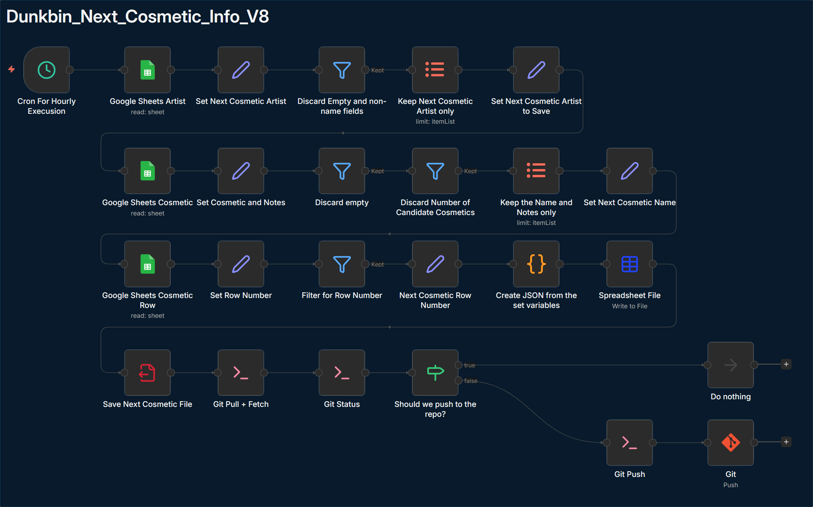
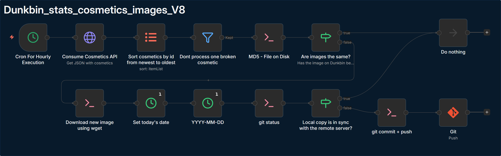
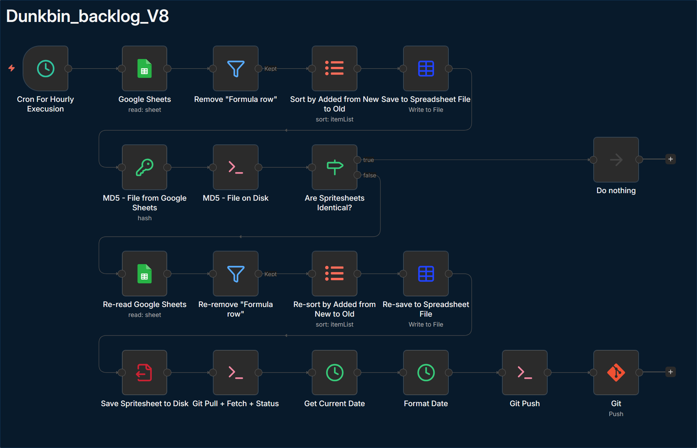
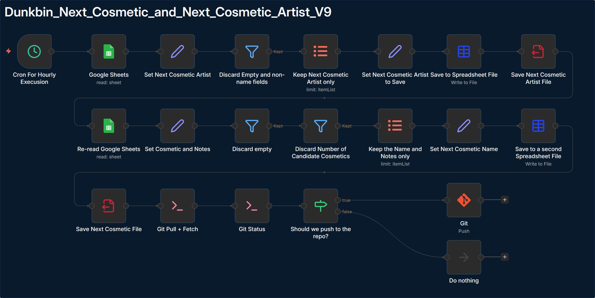
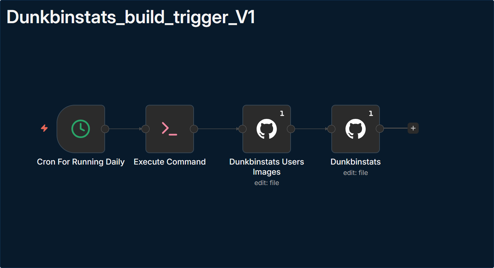
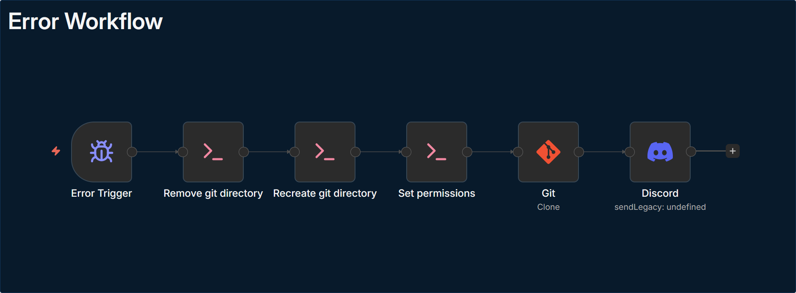
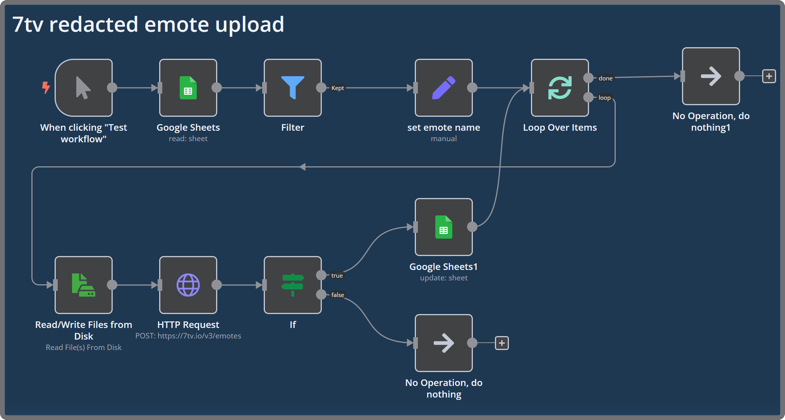
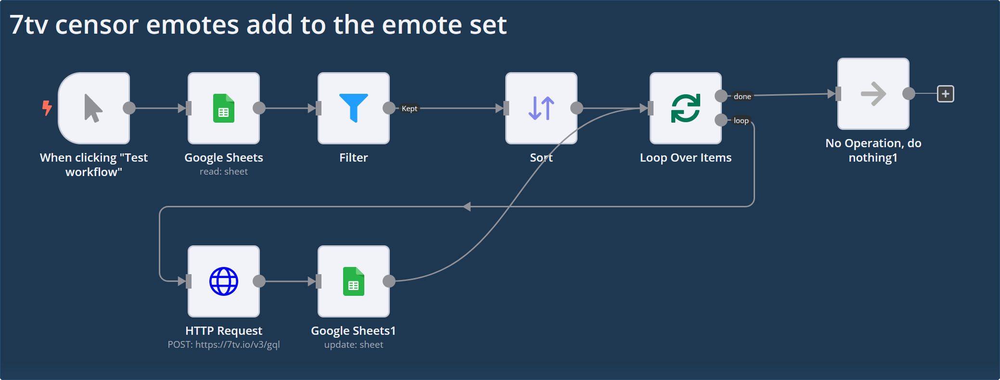
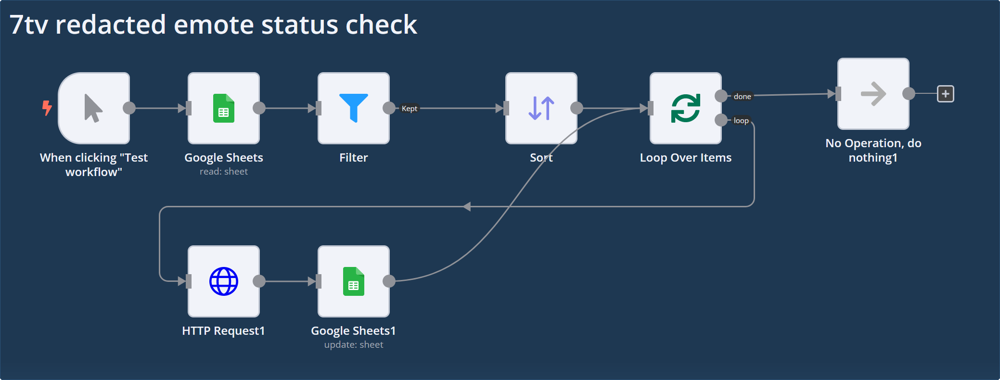

# dunkbin-stats-images

## Repo for dunkbin fantasy shop cosmetics and analytical dashboard.

### V8 workflow for the next cosmetic in the dunkbin

### V8 workflow chart

### Backlog spritesheet workflow chart V8

### Backlog spritesheet next cosmetic and next cosmetic artist chart V9

### Backlog spritesheet next cosmetic info V8

### Dunkbinstats build trigger V1

### Error Workflow

### Additional workflows

#### 7tv emotes upload workflow

### Gotchas

Running n8n inside a container requires

1. fixing writing priviliges -- Alpine: run as `root` in `sh` -- `chown node git/`.
2. Setting DNS server in case you run it alongside Adguard Home or similar, otherwise n8n will not be able to access external services.
3. GitHub credentials: use the classic token (as per n8n's docs).
